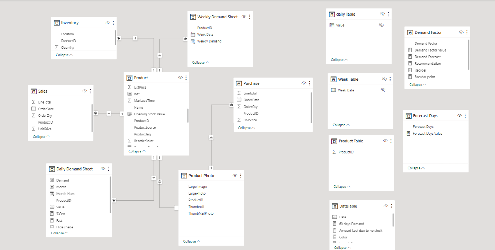
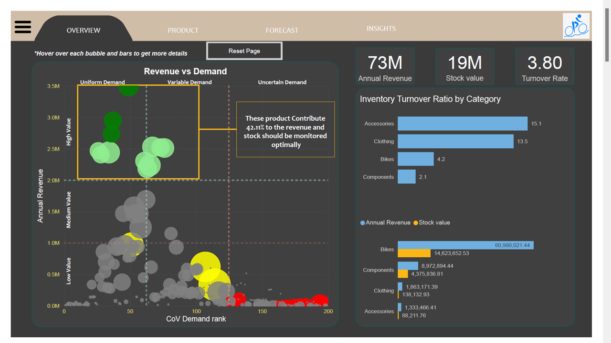
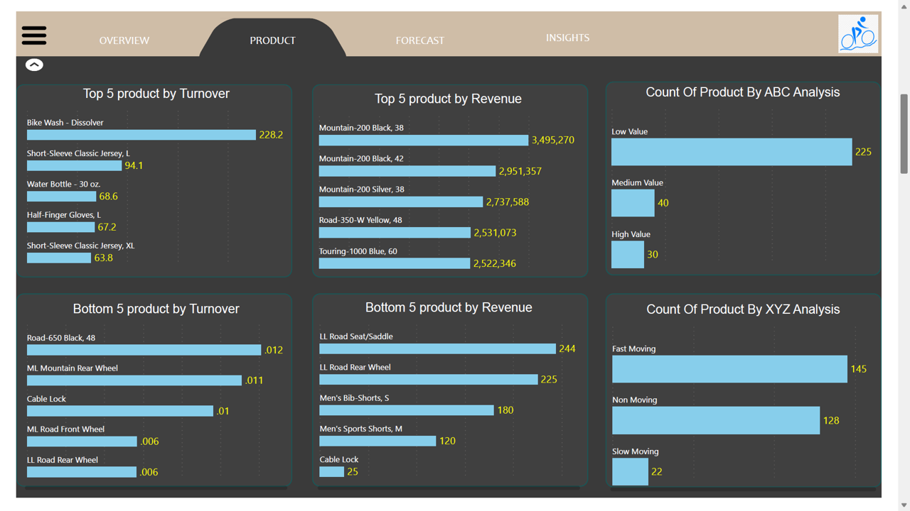
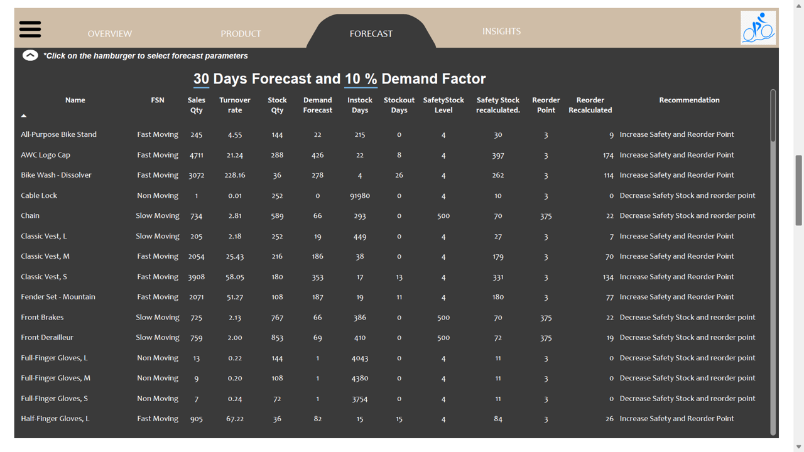
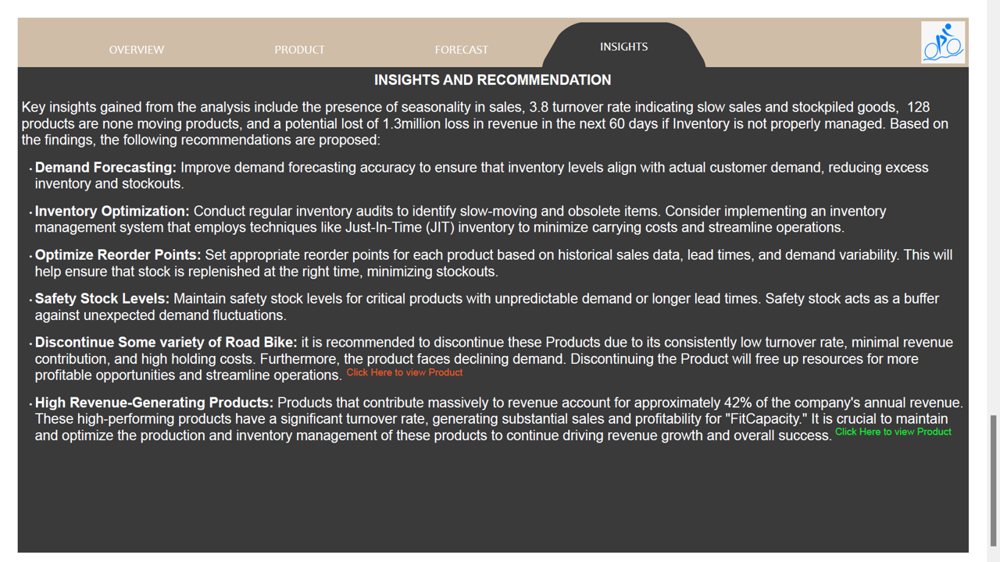
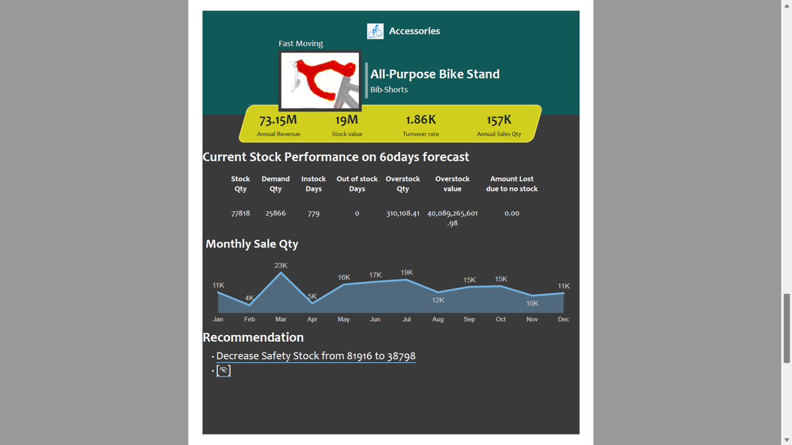
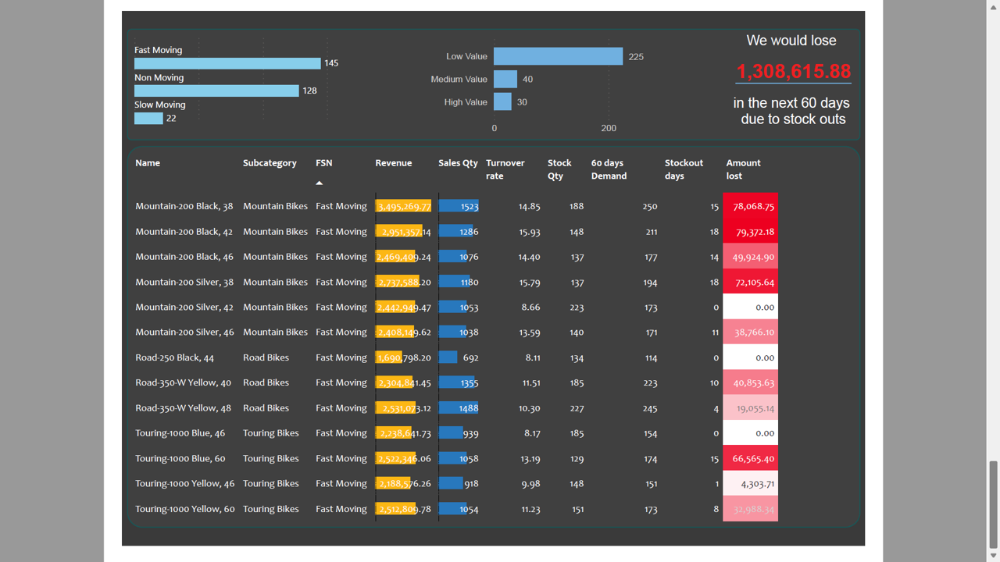

# Inventory-Management-Analysis
Inventory analysis report

[View here](https://app.powerbi.com/view?r=eyJrIjoiM2Q4ZTVkMmMtMmYwZi00YzQ2LWFjNDMtNDYwY2YyMzkwNDY2IiwidCI6ImQ2YjZlODcwLTkwNTgtNDgzOS1hOTJiLTNiNzRhMGI1ODliMSJ9)


## Introduction
The Inventory Management Optimization project aims to enhance FitCapacity's inventory management practices by leveraging data analysis and predictive modelling. This documentation outlines the process and steps involved in solving this business problem using data-driven insights.


## Problem Statement
FitCapacity faces challenges in managing its inventory effectively, resulting in issues such as stockouts and overstocking. The primary problems to address include:

- Identifying products with high and low turnover rates.
- Calculating the average time products are out of stock.
- Predicting demand for major products and forecasting stockout occurrences.
- Classifying products into high-selling, low-selling, and average-selling categories.


## Skills Demonstrated 
This project demonstrates the following skills and competencies:

- Data retrieval and manipulation using SQL.
- Descriptive statistics for data analysis.
- Data visualization with Power BI.
- Business problem-solving through data-driven insights.
- Deneb Visuals
- Tooltips
- Bookmarks
- Page Navigation etc

## Data Sourcing
Data for this analysis is sourced from the Adventure Works database, which contains comprehensive sales and inventory information. The following SQL queries were employed to extract relevant data:


 **Inventory Table**
 ```
SELECT
	ProductID
	,loc.Name Location
	,Quantity
FROM Production.ProductInventory inv
JOIN Production.Location loc
ON inv.LocationID = loc.LocationID

```

**Product Table**
 ```
SELECT 
	pro.ProductID,
	pro.Name,
	CASE WHEN pro.MakeFlag = 1 THEN 'Manufactured' ELSE 'Purchased' END AS ProductSource,
	CASE WHEN pro.FinishedGoodsFlag = 1 THEN 'Salable' ELSE 'Not Salable' END AS ProductTag,
	pro.SafetyStockLevel,
	pro.ReorderPoint,
	pro.StandardCost,
	pro.ListPrice,
	pro.SellStartDate,
	pro.SellEndDate,
	pro.DiscontinuedDate,
	ISNULL(psc.Name,'Others') Subcategory,
	ISNULL(pc.Name,'Others') Category,
	ISNULL(Avg(pur.AverageLeadTime) ,Avg(pro.DaysToManufacture)) AverageLeadTime,
	ISNULL(Max(pur.AverageLeadTime) ,Max(pro.DaysToManufacture)) MaxLeadTime
FROM Production.Product pro
LEFT JOIN Production.ProductSubcategory psc ON pro.ProductSubcategoryID = psc.ProductSubcategoryID
LEFT JOIN Production.ProductCategory pc ON psc.ProductCategoryID = pc.ProductCategoryID
LEFT JOIN Purchasing.ProductVendor pur ON pro.ProductID = pur.ProductID
GROUP BY pro.ProductID,
	pro.Name, CASE WHEN pro.MakeFlag = 1 THEN 'Manufactured' ELSE 'Purchased' END , 
	CASE WHEN pro.FinishedGoodsFlag = 1 THEN 'Salable' ELSE 'Not Salable' END ,
	pro.SafetyStockLevel,	pro.ReorderPoint,	pro.StandardCost,	pro.ListPrice,	pro.SellStartDate,
	pro.SellEndDate,	pro.DiscontinuedDate,	ISNULL(psc.Name,'Others') ,	ISNULL(pc.Name,'Others'),	DaysToManufacture
```

 **Sales Table**
 ```
Select 
	salesOD.ProductID,
	salesOD.OrderQty,
	salesOD.UnitPrice,
	salesOD.LineTotal,
	salesOH.OrderDate
FROM sales.SalesOrderDetail salesOD
JOIN Sales.SalesOrderHeader salesOH
ON salesOD.SalesOrderID = salesOH.SalesOrderID
WHERE salesOH.Status = 5
```
 **Product Photo Table**
 ```
SELECT ThumbNailPhoto,LargePhoto, ProductID
FROM Production.ProductPhoto pp
JOIN Production.ProductProductPhoto ppp
ON pp.ProductPhotoID = ppp.ProductPhotoID
```

 **Purchases Table**
 ```
Select 
	PurchaseOD.ProductID,
	PurchaseOD.StockedQty OrderQty,
	PurchaseOD.UnitPrice,
	PurchaseOD.StockedQty *	PurchaseOD.UnitPrice LineTotal,
	PurchaseOH.OrderDate
FROM Purchasing.PurchaseOrderDetail PurchaseOD
JOIN Purchasing.PurchaseOrderHeader PurchaseOH
ON PurchaseOD.PurchaseOrderID = PurchaseOH.PurchaseOrderID
WHERE PurchaseOH.Status = 4
```


## Data Transformation
Data transformation is a critical phase in preparing raw data for analysis. This phase encompasses several key processes and involves the creation of calculated tables and field parameters to facilitate the analysis:

### Calculated Tables

1. **Daily Table (Hidden)**:
A calculated table, 'Daily Table,' was generated to span the last 365 days of sales data using the following DAX expression:
`Daily Table = GENERATESERIES((MAX(Sales[OrderDate]) - 365), MAX(Sales[OrderDate]), 1)`
This table serves as a hidden reference for daily time intervals.

2. **Daily Demand Sheet**:
'Daily Demand Sheet' was created by combining 'Daily Table' and 'Product Table' with this DAX expression:
`Daily Demand Sheet = GENERATE('Daily Table', 'Product Table')`

3. **Week Table (Hidden)**:
Another calculated table, 'Week Table,' was generated to cover the last 365 days in weekly intervals. It is hidden from the model and created using the following DAX expression:
`Week Table = GENERATESERIES((MAX(Sales[OrderDate]) - 365), MAX(Sales[OrderDate]), 7)`

4. **Weekly Demand Sheet**:
'Weekly Demand Sheet' was created by combining 'Week Table' and 'Product Table':
`Weekly Demand Sheet = GENERATE('Week Table', 'Product Table')`

5. **DateTable**:
A DateTable was constructed to encompass the entire date range within the sales data, created with this DAX expression:
`DateTable = CALENDAR(MIN(Sales[OrderDate]), MAX(Sales[OrderDate]))`


### Field Parameters
Additionally, two field parameters were introduced to enhance flexibility in the analysis:

1. **Demand Factor**:
A parameter named 'Demand Factor' was defined, offering values ranging from -0.2 to 0.5 in steps of 0.1.

2. **Forecast Days**:
Another parameter named 'Forecast Days' was introduced, providing values ranging from 10 to 100 in increments of 10.

*These calculated tables and field parameters collectively play a pivotal role in the analysis, enabling dynamic exploration of demand factors and flexible forecasting over varying timeframes. They enhance the adaptability and robustness of the inventory management optimization process.*

**Calculating Turnover Rates**: Determining the turnover rates for each product. Turnover rates provide insights into how quickly products are sold and replenished. The formula for turnover rate is:
`Inventory Turnover Ratio = (SUM('Product'[Annual Revenue])/SUM('Product'[Stock value]))`

**Identifying Stockout Occurrences**: Detecting instances when products go out of stock. This involves tracking the transitions between product availability and unavailability. The average time a product remains out of stock is calculated.

**Data Preparation for Predictive Modeling**: Structuring the data in a format suitable for predictive modeling. This includes selecting relevant features and target variables, handling missing values, and encoding categorical variables if needed.

Data transformation is a crucial step to ensure that the data is clean, consistent, and ready for analysis and modeling. It sets the foundation for meaningful insights and accurate predictions in subsequent stages of the project.


## Data modeling
Snowflake model


## Analysis and Visualization
The report comprises 4 pages and 2 tooltip pages interact with it [here](https://app.powerbi.com/view?r=eyJrIjoiM2Q4ZTVkMmMtMmYwZi00YzQ2LWFjNDMtNDYwY2YyMzkwNDY2IiwidCI6ImQ2YjZlODcwLTkwNTgtNDgzOS1hOTJiLTNiNzRhMGI1ODliMSJ9)
All pages in the report feature a slide-in filter box activated using the hamburger menu, providing users with a seamless and user-friendly experience for refining and customizing their data exploration.
- Overview 
- Product
- Forecast
- Insight
*tooltip page*
- Tooltip Page 1
- Tooltip Page 2
  
  
### Overview Page
---


The Overview page serves as the starting point for the analysis, offering a bird's-eye view of FitCapacity's inventory and sales performance. It provides a high-level snapshot of key metrics such as turnover rate, revenue, and stock value. The visualizations on this page help stakeholders quickly grasp the overall health of the company's inventory management and sales performance.

**Turnover**: The overall turnover rate of 3.8 indicates that products are being sold at a moderate rate. Further exploration reveals that the turnover rates by category are as follows: Accessories at 15.1, Clothing at 13.5, Bikes at 4.2, and Components at 2.1. This data sheds light on which product categories are performing well.

**Most Valuable Products**: In the last year, 12 products have contributed a substantial 42% to FitCapacity's revenue. These products exhibit consistent demand across both uniform and variable demand categories. It's noteworthy that all of these high-performing products belong to the Bikes category.

**Revenue**: The revenue generated in the past year amounts to a substantial $73 million, with Bikes accounting for the lion's share at $60 million.

**Stock Value**: The total stock value currently stands at $14 million.

This analysis provides actionable insights that can inform strategic decisions for FitCapacity, particularly in optimizing product categories, managing stock levels, and further enhancing revenue generation.


### Product Page
---


The Product page is a comprehensive exploration of FitCapacity's product landscape, offering valuable insights into inventory performance and sales revenue. It is designed to provide a deep dive into product-related metrics and analyses, enabling stakeholders to make informed decisions.

**Top 5 Products by Turnover**: This section of the Product page highlights the five products with the highest turnover rates, indicating swift sales and replenishment. Identifying these top performers helps pinpoint products in high demand, contributing significantly to sales velocity.

**Bottom 5 Products by Turnover**: In contrast to the top performers, this section of the Product page presents the five products with the lowest turnover rates. These products move at a slower pace, potentially indicating the need for closer scrutiny and potential strategies for boosting sales.

**Top 5 Products by Revenue**: Here, the Product page showcases the five revenue-generating champions over the past year. These products are the financial powerhouses, contributing the most substantial share to FitCapacity's revenue.

**Bottom 5 Products by Revenue**: In contrast to the top revenue generators, this section presents the five products with the lowest revenue contribution. Understanding these products is crucial for identifying areas where sales and marketing efforts may need to be adjusted or discontinued.

**Product Count by ABC Analysis**: The ABC analysis categorizes products into three groups: A, B, and C, based on their contribution to revenue. Group A typically consists of a small number of high-value products that contribute the most to revenue. Group B comprises moderate-value products, and Group C includes numerous low-value products. This categorization aids in prioritizing inventory management efforts and resource allocation.

**Product Count by XYZ Analysis**: The XYZ analysis classifies products into three categories: X, Y, and Z, based on demand variability. Category X represents products with stable and predictable demand, while Category Y includes products with moderate demand variability. Category Z consists of products with highly unpredictable demand. This classification informs inventory strategies, helping determine stocking levels and reorder points for each product category.

The Product page is a vital resource for understanding the performance and characteristics of FitCapacity's product portfolio. It empowers decision-makers with the information needed to optimize inventory levels, prioritize high-performing products, and enhance overall inventory management strategies.


### Forecast Page
---


The Forecast page in the report utilizes the dynamic parameter table created earlier, allowing users to fine-tune their forecasting efforts. This interactive feature empowers stakeholders to adjust the number of forecasted days and the demand factor, enabling a more customized approach to demand prediction.

**Customizable Forecast Parameters**: Users have the flexibility to change the number of days for the forecast and adjust the demand factor according to their specific needs. This level of customization ensures that forecasts align with varying scenarios and changing market dynamics.

**Product-Specific Recommendations**: For each product, the Forecast page provides tailored recommendations based on the adjusted forecasting parameters. These recommendations are essential for optimizing inventory levels and ensuring that products are stocked and replenished effectively.

**Safety Stock and Reorder Point Recalculation**: The page also recalculates safety stock and reorder point values based on the modified parameters. Safety stock levels act as a buffer against unexpected demand fluctuations, while reorder points determine when stock should be replenished. The dynamic recalculation ensures that inventory management strategies remain aligned with the chosen forecast parameters.

The Forecast page is a powerful tool for decision-makers, allowing them to explore various forecasting scenarios, receive product-specific guidance, and adapt their inventory strategies to meet changing market conditions effectively.

### Insight
---


The Insight page synthesizes the most critical findings and recommendations from the analysis. It consolidates key insights such as the presence of seasonality in sales, turnover rates, non-moving products, and potential revenue loss. This page serves as a strategic guide for decision-makers, offering actionable recommendations for enhancing inventory management practices, optimizing stock levels, and maintaining revenue growth.

### Tooltip pages 
---
| Tooltip page 1 | Tooltip page 2 |
|----------|----------|
| ||

The two tooltip pages provide additional context and details when interacting with the visualizations on the main pages. Tooltip Page 1 and Tooltip Page 2 offer on-demand information to assist users in understanding specific data points, trends, or anomalies within the visualizations. These pages enhance the interactivity and depth of analysis for users exploring the report.

Each page in the report plays a distinct role in providing insights and facilitating data-driven decision-making for FitCapacity's inventory management optimization efforts.


## Conclusion

The analysis of FitCapacity's inventory management data has provided valuable insights into the current state of inventory practices and sales dynamics. These insights shed light on critical areas that require attention and improvement. As we conclude this inventory management optimization project, several key takeaways and recommendations emerge:

### Key Takeaways

1. **Seasonality in Sales:** The presence of seasonality in sales highlights the importance of aligning inventory levels with actual customer demand during peak seasons. This insight underscores the need for proactive inventory planning to avoid stockouts or overstocking during high-demand periods.

2. **Low Turnover Rate:** The turnover rate of 3.8 signifies slow sales and a surplus of stockpiled goods. This observation emphasizes the urgency of optimizing inventory levels to prevent excess inventory accumulation and minimize the risk of stockouts. 

3. **Identification of Non-Moving Products:** The identification of 128 non-moving products raises concerns about stagnant inventory that may lead to potential losses. These products warrant special attention, including strategies for clearance or reevaluation of their relevance in the product portfolio.

4. **Potential Revenue Loss:** The analysis reveals a potential loss of $1.3 million in revenue in the next 60 days if inventory is not properly managed. This underscores the critical role of effective inventory management in maintaining revenue streams and profitability.

## Recommendations

To address these insights and enhance inventory management practices, the following recommendations have been proposed:

- **Demand Forecasting:** Improve demand forecasting accuracy to ensure that inventory levels align with actual customer demand, reducing excess inventory and stockouts.

- **Inventory Optimization:** Conduct regular inventory audits to identify slow-moving and obsolete items. Consider implementing an inventory management system that employs techniques like Just-In-Time (JIT) inventory to minimize carrying costs and streamline operations.

- **Optimize Reorder Points:** Set appropriate reorder points for each product based on historical sales data, lead times, and demand variability. This will help ensure that stock is replenished at the right time, minimizing stockouts.

- **Safety Stock Levels:** Maintain safety stock levels for critical products with unpredictable demand or longer lead times. Safety stock acts as a buffer against unexpected demand fluctuations.

- **Discontinue Low-Performing Products:** It is recommended to discontinue products with consistently low turnover rates, minimal revenue contribution, high holding costs, and declining demand. This will free up resources for more profitable opportunities and streamline operations.

- **Prioritize High Revenue-Generating Products:** Products that contribute significantly to revenue should be prioritized, as they account for approximately 42% of the company's annual revenue. Maintaining and optimizing the production and inventory management of these products is crucial for continued revenue growth and overall success.

In conclusion, the Inventory Management Optimization project equips FitCapacity with actionable insights and a roadmap for improving inventory practices. Effective implementation of these recommendations will not only lead to better inventory management but also contribute to increased profitability, reduced costs, and enhanced operational efficiency. It is imperative for FitCapacity to embrace these recommendations and embark on a journey towards optimized inventory management for sustained success.
